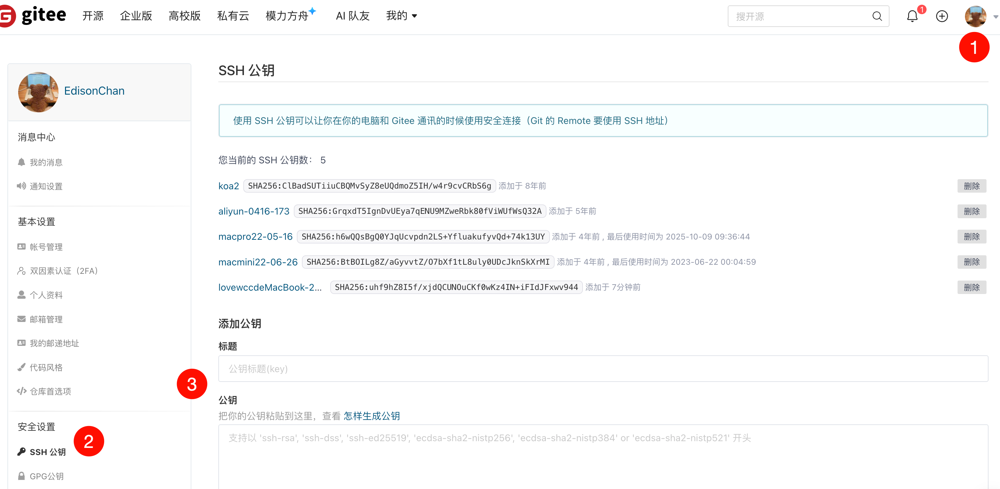
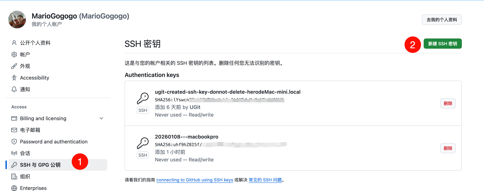

# SSH 公钥设置

<mark style="background: #FFF3A3A6;">Gitee 提供了基于 SSH 协议的 Git 服务，在使用 SSH 协议访问仓库仓库之前，需要先配置好账户 SSH 公钥。</mark>

> 仓库公钥（部署公钥）请移步 [添加部署公钥](https://help.gitee.com/repository/ssh-key/generate-and-add-ssh-public-key)

## 生成 SSH 公钥

> Windows 用户建议使用 **Windows PowerShell** 或者 **Git Bash**，在 **命令提示符** 下无 `cat` 和 `ls` 命令。

1. 通过命令 `ssh-keygen` 生成 SSH Key：

```
ssh-keygen -t ed25519 -C "148373644@qq.com"  //输入自己的📮地址

ssh-keygen -t ed25519 -C "Gitee SSH Key"
```

- `-t` key 类型
- `-C` 注释

输出，如：

```
ssh-keygen -t ed25519 -C "148373644@qq.com"
Generating public/private ed25519 key pair.
Enter file in which to save the key (/Users/lovewcc/.ssh/id_ed25519): 
Enter passphrase for "/Users/lovewcc/.ssh/id_ed25519" (empty for no passphrase): 
Enter same passphrase again: 
Your identification has been saved in /Users/lovewcc/.ssh/id_ed25519
Your public key has been saved in /Users/lovewcc/.ssh/id_ed25519.pub
The key fingerprint is:
SHA256:D6fphcL8l0AmYWxOXOXHkqIUlmQ8YDv0pogIMYG4mSc 148373644@qq.com
The key's randomart image is:
+--[ED25519 256]--+
|*.  +*=o...      |
|oo o =@. . o     |
|.+  o=+o. + o    |
|E... =o.o. o     |
|oo. . .+S .      |
|     o  .B       |
|      + +.o.     |
|       + .o      |
|        o.       |
+----[SHA256]-----+
```

- 中间通过三次**回车键**确定

2. 查看生成的 SSH 公钥和私钥：


```
 cat ~/.ssh/id_rsa.pub
```


```
ls ~/.ssh/
```

输出：

```
id_ed25519  id_ed25519.pub
```

- 私钥文件 `id_ed25519`
- 公钥文件 `id_ed25519.pub`

3. 读取公钥文件 `~/.ssh/id_ed25519.pub`：

```
cat ~/.ssh/id_ed25519.pub
```

输出，如：

```
ssh-ed25519 AAAA***5B Gitee SSH Key
```

复制终端输出的公钥。

## 设置账户 SSH 公钥

用户可以通过主页右上角 **「个人设置」->「安全设置」->「SSH 公钥」->「[添加公钥](https://gitee.com/profile/sshkeys)」** ，添加生成的 public key 添加到当前账户中。

> 需要注意： **添加公钥需要验证用户密码**
## gitee配置


## github配置



通过 `ssh -T` 测试时，输出 **Anonymous**：

```
$ ssh -T git@gitee.com

Hi Anonymous! You've successfully authenticated, but GITEE.COM does not provide shell access.
```

添加成功后，就可以使用 SSH 协议对仓库进行**拉取**。

