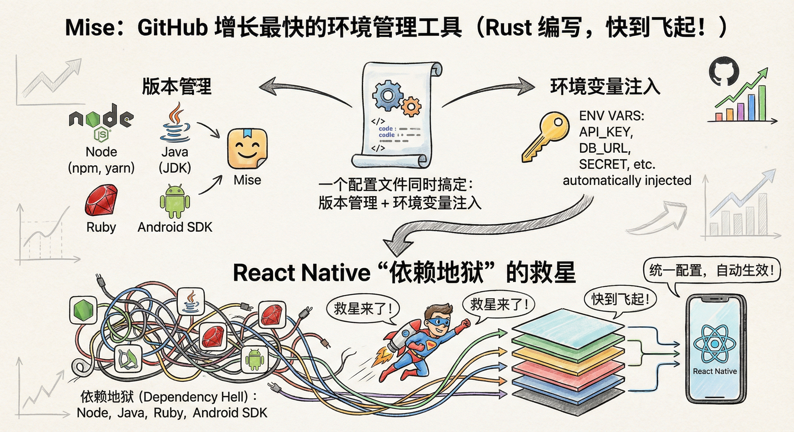
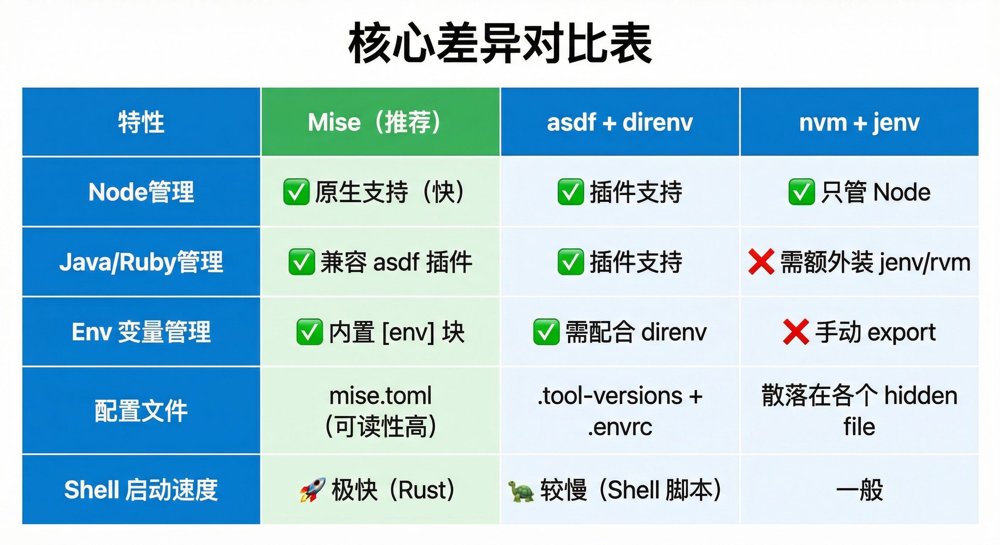

Jerry，既然你选择了 **方案一：Mise (mise-en-place)**，说明你对效率和开发体验有很高的追求。

Mise 是目前 GitHub 上增长最快的环境管理工具之一（Rust 编写，快到飞起），它最大的杀手锏就是**“在一个配置文件里同时搞定版本管理 + 环境变量注入”**。

这对于 React Native 这种“依赖地狱”（同时涉及 Node, Java, Ruby, Android SDK）的项目来说，简直是救星。

以下是保姆级的落地指南：

## 第一步：极速安装 (Mac/Linux)

既然是前端，我默认你使用 Mac。打开终端：

bash

`# 1. 使用 Homebrew 安装 (推荐) brew install mise # 2. 激活 (这是最关键的一步，很多人漏掉) # 如果你用 zsh (Mac默认): echo 'eval "$(mise activate zsh)"' >> ~/.zshrc source ~/.zshrc # 如果你用 bash: echo 'eval "$(mise activate bash)"' >> ~/.bashrc source ~/.bashrc`

**验证安装**：输入 `mise --version`，应该能看到版本号。

---

## 第二步：配置你的“新老项目”

Mise 的核心是一个叫 `mise.toml` 的文件。你不需要全局安装任何语言，只需要在每个项目根目录下放这个文件。

## 场景 A：你的老 RN 项目 (比如 RN 0.6x)

假设老项目需要：Node 14, JDK 11 (原神版), Ruby 2.7 (CocoaPods 旧版)。

在老项目根目录新建 `mise.toml`：

text

`# 老项目/mise.toml [tools] node = "14.21.3" java = "temurin-11"  # 自动下载并使用 OpenJDK 11 ruby = "2.7.6"       # 对应老版 iOS 依赖 [env] # 【核心魔法】自动设置 JAVA_HOME # 当你进入该目录，mise 会算出 java 11 的绝对路径并赋值给 JAVA_HOME JAVA_HOME = "{{exec(command='mise where java')}}" # 如果老项目必须用一个旧的 Android SDK 目录 (可选) ANDROID_HOME = "/Users/jerry/Library/Android/sdk-legacy"`

## 场景 B：你的新 RN 项目 (RN 0.76+)

假设新项目需要：Node 20, JDK 17, Ruby 3.x。

在新项目根目录新建 `mise.toml`：

text

`# 新项目/mise.toml [tools] node = "20.10.0" java = "temurin-17"  # 新版 RN 强制要求 JDK 17 ruby = "3.2.2" [env] # 这里会自动变成 JDK 17 的路径 JAVA_HOME = "{{exec(command='mise where java')}}" # 指向标准 Android SDK ANDROID_HOME = "/Users/jerry/Library/Android/sdk"`

---

## 第三步：见证奇迹 (Workflow)

当你配置好后，工作流是这样的：

1. **首次进入项目**：
    
    bash
    
    `cd my-old-project mise install  # 第一次会自动下载 Node 14, Java 11, Ruby 2.7 (并行下载，很快)`
    
2. **日常开发**：
    
    bash
    
    `# 早上先去维护老项目 cd ~/my-old-project node -v   # -> v14.21.3 java -version # -> 11.0.x echo $JAVA_HOME # -> /Users/jerry/.../mise/installs/java/temurin-11... # 下午开发新功能 cd ~/my-new-project node -v   # -> v20.10.0 (瞬间切换) java -version # -> 17.0.x (瞬间切换) echo $JAVA_HOME # -> /Users/jerry/.../mise/installs/java/temurin-17...`
    

**这就是你想要的：** 没有 `nvm use`, 没有 `source jenv`, 也没有手动改环境变量。`cd` 就是开关。

---

## 进阶技巧 (专门针对 RN 前端)

## 1. 解决全局工具冲突 (Yarn/Pod)

老项目可能还在用 `yarn 1.x`，新项目想用 `yarn 3.x` 或者 `pnpm`。Mise 也可以管理这个：

text

`# 新项目/mise.toml [tools] node = "20" yarn = "3.6.4" # 强制该项目使用 yarn 3`

## 2. 兼容现有配置

如果你的团队里其他人还在用 `nvm` 或 `asdf`，Mise 会自动读取现有的 `.nvmrc` 和 `.tool-versions` 文件。你甚至不需要创建 `mise.toml` 。[[betterstack](https://betterstack.com/community/guides/scaling-nodejs/mise-vs-asdf/)]​

- 但建议你**创建 `mise.toml`**，因为只有它支持 `[env]` 部分（自动切 `JAVA_HOME` 的关键）。
    

## 3. 常用命令速查

- `mise ls`: 查看当前目录下生效的所有工具版本。
    
- `mise where java`: 查看当前 Java 的真实安装路径（Gradle 报错时很有用）。
    
- `mise global node 20`: 设置默认全局版本（当你在非项目目录时使用）。
    


这是一个非常经典的问题，别担心。简单来说：**`mise` 和 `nvm` 是两家互不通用的“仓库”。**

虽然你的电脑里已经有了 `nvm` 下载的 Node 20.19.6（存在 nvm 的仓库里），但 `mise` 默认是不知道、也不会去借用它
的。

## 🚀 快速修复命令

请直接运行以下命令之一来安装 Java 17：

## 选项 A：让 Mise 自动选择（最推荐，简单省心）

直接安装 `java@17`，Mise 会自动拉取最新的 Adoptium Temurin OpenJDK 17（这是 React Native 社区最推荐的版本）。

bash

`mise use java@17 # 或者 mise install java@17`

## 选项 B：强制指定 Zulu 版本（如果你必须用 Zulu）

Zulu 的命名在 Mise (asdf-java 插件) 中通常是 `zulu-17.xx.xx` 格式。你需要先查一下确切的名字：

1. **查看可用的 Zulu 版本列表**：
    
    bash
    
    `mise ls-remote java | grep zulu | grep 17`
    
2. **安装查到的具体版本**（例如）：
    
    bash
    
    `mise install java@zulu-17.46.19`
    

---

## 🧐 为什么会报错？

报错 `java@17.0.9-zulu not installed` 意味着 Mise 在它的远程版本列表里找不到完全匹配这个字符串的版本。

- Mise 的 Java 插件底层经常复用 `asdf-java` 的源。
    
- 不同的 OpenJDK 发行版（Temurin, Zulu, Corretto）在列表里的命名格式是不一样的。
    
    - Temurin (推荐): `temurin-17.0.9`
        
    - Zulu: `zulu-17.46.19` (Zulu 经常用它自己的内部版本号)
        
    - Open (官方): `openjdk-17.0.2`
## 为什么会这样？

1. **隔离原则**：Mise 为了保证环境的绝对纯净和可复现性（Works on My Machine -> Works on Our Machines），它倾向于使用自己下载、自己管理的版本。这样可以避免因为你手动魔改过 nvm 里的某个文件而导致整个团队出问题。
    
2. **路径不同**：
    
    - **nvm** 存放在：`~/.nvm/versions/node/v20.19.6/...`
        
    - **mise** 存放在：`~/.local/share/mise/installs/node/20.19.6/...`

## <mark style="background: #FF5582A6;">强制安装</mark>

``` bash
mise install node@16.19.1 --force
```


你终端里敲 `node -v` 明明是 **v16.19.1**，但一跑 `react-native start` (Metro Bundler)，它却像中了邪一样去用 **v25.2.1**，然后报错。

**原因分析：**  
这通常是因为 `react-native start` 并不是直接在当前 shell 进程里跑 JS，而是**启动了一个新的子进程**或者**调用了某个全局安装的命令**（比如全局的 `react-native-cli` 或 `yarn`），而这个全局命令并没有继承当前 Mise 注入的环境变量 `PATH`，反而回退到了系统默认的 Node 25。

## 🔪 解决方案：斩断 Node 25 的干扰

请按顺序尝试以下三招，招招致命：

## 第一招：用 `mise exec` 显式包裹运行 (最稳准狠)

不要直接运行 `npm start`，而是让 Mise 强制接管该命令的执行环境。

**请运行：**

bash

`# 这一行命令的意思是： # "Mise 你给我听好了，用你当前环境里的 node (v16) 去执行后面的命令" mise exec -- npm start`

## 第二招：通过 Gradle 强制指定 (针对 Android 编译)

如果你是在 `react-native run-android` 时报错（不仅仅是 start），说明 Gradle 也没找到正确的 Node。

打开 `android/build.gradle` (项目根目录下的那个)，加入这段配置：

```bash
allprojects {
    repositories {
        // ...
    }
    // 强制 Gradle 使用 mise 的 node 路径
    // 你需要先在终端运行 `which node` 拿到 v16 的绝对路径
    // 例如: /Users/lovewcc/.local/share/mise/installs/node/16.19.1/bin/node
    project.ext.react = [
        nodeExecutableAndArgs: ["/Users/lovewcc/.local/share/mise/installs/node/16.19.1/bin/node"]
    ]
}

```


## 🔮 总结

## 总结


方案一 (Mise) 是目前 React Native 开发者的**终极解法**。它把 Node (JS侧)、Java (Android侧)、Ruby (iOS侧) 的版本管理整合成了一套逻辑，彻底消除了“切了 Node 忘了切 Java 导致编译失败”的痛苦 。[mise.jdx+1](https://mise.jdx.dev/dev-tools/comparison-to-asdf.html)

周末花 10 分钟配置一下，周一上班你会感谢自己的。

