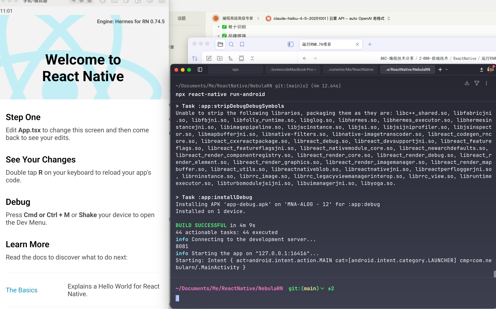

## 快速解决方案

```bash
# ❌ 错误命名（包含连字符）
npx react-native@0.74.5 init Nebula-RN74

# ✅ 正确命名（驼峰或纯小写）
npx react-native@0.74.5 init NebulaRN

# 或者
npx react-native@0.74.5 init nebularn
```

---

## 推荐的项目命名

根据你的场景，这些名字都可以：

### 方案 1：驼峰命名（推荐 ⭐⭐⭐⭐⭐）
```bash
npx react-native@0.74.5 init NebulaRN --version 0.74.5
```

### 方案 2：全小写
```bash
npx react-native@0.74.5 init nebularn --version 0.74.5
```

### 方案 3：描述性命名
```bash
npx react-native@0.74.5 init DynamicModuleLoader --version 0.74.5
```

---

## 完整创建流程（复制即用）

```bash
# 1. 确保使用 Node 18
nvm use 18

# 2. 清理 npx 缓存（解决版本警告）
npx clear-npx-cache

# 3. 创建项目（使用正确的命名）
npx react-native@0.74.5 init NebulaRN --version 0.74.5

# 4. 进入项目
cd NebulaRN

# 5. 配置 Node 版本锁定
echo "18.18.2" > .nvmrc

# 6. 检查环境
npx react-native doctor

# 7. 安装依赖
npm install

# 8. 启动项目测试
npm run ios  # 或 npm run android
```

---

## 关于 NPX 缓存警告

那个 `WARNING` 是正常的，有两种处理方式：

### 方式 1：忽略警告（推荐）
```bash
# 直接创建，警告不影响功能
npx react-native@0.74.5 init NebulaRN --version 0.74.5
```

### 方式 2：清理缓存
```bash
# 清理 npx 缓存
npx clear-npx-cache

# 或手动删除
rm -rf ~/.npm/_npx

# 然后创建项目
npx react-native@0.74.5 init NebulaRN --version 0.74.5
```

---

## 项目命名规则总结

React Native 项目名必须符合：

| 规则 | ✅ 允许 | ❌ 不允许 |
|------|---------|-----------|
| 字符类型 | 字母、数字 | 连字符 `-`、下划线 `_`、空格 |
| 首字符 | 字母 | 数字 |
| 大小写 | 驼峰 `NebulaRN` 或 小写 `nebularn` | 不限制 |
| 长度 | 建议 < 30 字符 | 无硬性限制 |

**示例**：
```bash
✅ NebulaRN
✅ nebularn
✅ DynamicBundleLoader
✅ MyApp2024

❌ Nebula-RN
❌ nebula_rn
❌ My App
❌ 2024App (数字开头)
```

---

## 推荐最终命名

基于你的项目特性，我推荐：

```bash
npx react-native@0.74.5 init NebulaRN --version 0.74.5
```

**理由**：
- ✅ 简洁（8个字符）
- ✅ 符合命名规范
- ✅ 易于识别
- ✅ 品牌感强

---

## 创建后的验证步骤

```bash
# 进入项目
cd NebulaRN

# 验证版本
cat package.json | grep '"react-native"'
# 应该显示："react-native": "0.74.5"

# 验证 bundle ID
# iOS
cat ios/NebulaRN/Info.plist | grep -A 1 CFBundleIdentifier
# Android
cat android/app/build.gradle | grep applicationId

# 测试运行
npx react-native run-ios --simulator="iPhone 15"
```

---

现在直接运行这个命令吧：

```bash
npx react-native@0.74.5 init NebulaRN --version 0.74.5
```

创建完成后告诉我，我们继续配置动态分包的架构！🚀


看你的 Java 版本是 **1.8（Java 8）**，现在要升级到 **Java 17** 来运行新项目。

## 快速回答

**不会影响老项目！** ✅ 可以让多个 Java 版本共存，按需切换。

---

## 🎯 推荐方案：多版本共存

### 方案 1：使用 SDKMAN 管理（最推荐）⭐⭐⭐⭐⭐

```bash
# 1. 安装 SDKMAN
curl -s "https://get.sdkman.io" | bash
source "$HOME/.sdkman/bin/sdkman-init.sh"

# 2. 安装 Java 17（不删除 Java 8）
sdk install java 17.0.9-zulu

# 3. 查看所有已安装的 Java 版本
sdk list java

# 4. 按项目切换 Java 版本
# 新项目目录（NebulaRN）
cd NebulaRN
sdk use java 17.0.9-zulu

# 老项目目录

# 将你的Zulu JDK注册为本地版本
sdk install java 8-zulu-local /Library/Java/JavaVirtualMachines/zulu-8.jdk/Contents/Home


cd /path/to/old-project
sdk use java 8-zulu-local

# 5. 设置项目级别的默认版本
# 在 NebulaRN 目录下
echo "17.0.9-zulu" > .sdkmanrc

# 在老项目目录下
echo "8.0.472-zulu" > .sdkmanrc

# ✅ 以后进入目录会自动切换 Java 版本
```

---

### 方案 2：手动安装并用脚本切换

```bash
# 1. 安装 Java 17（保留 Java 8）
brew install openjdk@17

# 2. 创建切换脚本
# 编辑 ~/.zshrc 或 ~/.bash_profile

# Java 8 环境
alias java8='export JAVA_HOME=$(/usr/libexec/java_home -v 1.8)'

# Java 17 环境
alias java17='export JAVA_HOME=$(/usr/libexec/java_home -v 17)'

# 3. 重新加载配置
source ~/.zshrc

# 4. 使用方式
# 运行老项目前
java8
java -version  # 显示 1.8.0_472

# 运行新项目前
java17
java -version  # 显示 17.0.x
```

---

### 方案 3：项目级 Gradle 配置（最稳妥）⭐⭐⭐⭐⭐

这是最推荐的方式，**完全不需要切换系统 Java 版本**！

#### 新项目配置（NebulaRN）

```bash
# 编辑 android/gradle.properties
vim NebulaRN/android/gradle.properties
```

```properties
# 添加这行，指定 Gradle 使用的 Java 版本
org.gradle.java.home=/Library/Java/JavaVirtualMachines/openjdk-17.jdk/Contents/Home

# 或者如果你用 Homebrew 安装的：
org.gradle.java.home=/opt/homebrew/opt/openjdk@17/libexec/openjdk.jdk/Contents/Home
```

#### 老项目配置

```bash
# 编辑老项目的 android/gradle.properties
vim /path/to/old-project/android/gradle.properties
```

```properties
# 指定使用 Java 8
org.gradle.java.home=/Library/Java/JavaVirtualMachines/zulu-8.jdk/Contents/Home
```

**优点**：
- ✅ 系统 Java 版本保持不变
- ✅ 每个项目独立配置
- ✅ 不需要切换命令
- ✅ 最稳定可靠

---

## 📋 完整配置流程（推荐组合方案）

### 步骤 1：安装 Java 17

```bash
# 使用 Homebrew 安装
brew install openjdk@17

# 查看安装路径
ls -la /opt/homebrew/opt/openjdk@17/libexec/openjdk.jdk/Contents/Home

# 或者
/usr/libexec/java_home -V
# 输出示例：
# 17.0.9 (x86_64) "Homebrew" - "OpenJDK 17.0.9"
# 1.8.0_472 (x86_64) "Azul Systems, Inc." - "Zulu 8.90.0.19"
```

### 步骤 2：配置新项目（NebulaRN）

```bash
cd NebulaRN

# 创建或编辑 android/gradle.properties
cat >> android/gradle.properties << 'EOF'

# Gradle Java 版本配置
org.gradle.java.home=/opt/homebrew/opt/openjdk@17/libexec/openjdk.jdk/Contents/Home

# Gradle 性能优化
org.gradle.jvmargs=-Xmx4096m -XX:MaxMetaspaceSize=512m -XX:+HeapDumpOnOutOfMemoryError
org.gradle.parallel=true
org.gradle.daemon=true
org.gradle.configureondemand=true
EOF
```

### 步骤 3：验证配置

```bash
cd NebulaRN/android

# 验证 Gradle 使用的 Java 版本
./gradlew --version

# 应该显示：
# ------------------------------------------------------------
# Gradle 8.6
# ------------------------------------------------------------
# JVM:          17.0.9 (Homebrew 17.0.9)  # ✅ 这里是 17
# OS:           Mac OS X 14.x aarch64
```

### 步骤 4：老项目保持不变

```bash
cd /path/to/old-project/android

# 验证老项目仍使用 Java 8
./gradlew --version

# 应该显示：
# JVM:          1.8.0_472 (Azul Systems 1.8.0_472-b08)  # ✅ 这里是 8
```

---

## 🔍 不同方案对比

| 方案 | 优点 | 缺点 | 推荐度 |
|------|------|------|--------|
| **SDKMAN** | 自动管理多版本<br>切换简单 | 需要安装额外工具 | ⭐⭐⭐⭐⭐ |
| **gradle.properties** | 项目隔离<br>无需切换 | 需要配置每个项目 | ⭐⭐⭐⭐⭐ |
| **手动切换 alias** | 简单直接 | 容易忘记切换<br>可能出错 | ⭐⭐⭐ |
| **全局替换 Java** | 不需要配置 | 会影响所有项目 | ❌ 不推荐 |

---

## 🎭 实际使用场景

### 场景 1：同时维护多个项目

```bash
# 项目结构
~/Projects/
├── NebulaRN/              # RN 0.74 + Java 17
│   └── android/
│       └── gradle.properties  # org.gradle.java.home=Java17路径
├── OldProjectRN071/       # RN 0.71 + Java 11
│   └── android/
│       └── gradle.properties  # org.gradle.java.home=Java11路径
└── LegacyProjectRN068/    # RN 0.68 + Java 8
    └── android/
        └── gradle.properties  # org.gradle.java.home=Java8路径

# 运行任意项目都不需要切换 Java
cd NebulaRN && npx react-native run-android       # ✅ 自动用 Java 17
cd OldProjectRN071 && npx react-native run-android # ✅ 自动用 Java 11
cd LegacyProjectRN068 && npx react-native run-android # ✅ 自动用 Java 8
```

### 场景 2：使用 SDKMAN 自动切换

```bash
# 配置 .sdkmanrc 文件
cd NebulaRN
echo "17.0.9-zulu" > .sdkmanrc

cd OldProject
echo "8.0.472-zulu" > .sdkmanrc

# 以后只要进入目录，Java 版本自动切换
cd NebulaRN
# SDKMAN 自动切换到 Java 17

cd OldProject
# SDKMAN 自动切换到 Java 8
```

---

## ⚠️ 注意事项

### 1. 验证 Java 路径

```bash
# 查看所有 Java 安装位置
/usr/libexec/java_home -V

# 输出示例：
# Matching Java Virtual Machines (2):
#     17.0.9 (arm64) "Homebrew" - "OpenJDK 17.0.9" /opt/homebrew/Cellar/openjdk@17/17.0.9/libexec/openjdk.jdk/Contents/Home
#     1.8.0_472 (arm64) "Azul Systems, Inc." - "Zulu 8.90.0.19" /Library/Java/JavaVirtualMachines/zulu-8.jdk/Contents/Home
```

### 2. Android Studio 配置

如果你使用 Android Studio：

```bash
# Android Studio → Settings/Preferences
# → Build, Execution, Deployment
# → Build Tools
# → Gradle

# JDK 设置：
# 新项目（NebulaRN）选择：Java 17
# 老项目选择：Java 8
```

### 3. 环境变量冲突

```bash
# 如果设置了全局 JAVA_HOME，可能会冲突
# 检查 ~/.zshrc 或 ~/.bash_profile

# ❌ 删除或注释这种全局设置：
# export JAVA_HOME=$(/usr/libexec/java_home -v 1.8)

# ✅ 改为项目级配置（gradle.properties）
```

---

## 🚀 最终推荐方案

**组合使用**：

```bash
# 1. 安装 Java 17（不删除 Java 8）
brew install openjdk@17

# 2. 新项目使用 gradle.properties 配置
echo 'org.gradle.java.home=/opt/homebrew/opt/openjdk@17/libexec/openjdk.jdk/Contents/Home' >> NebulaRN/android/gradle.properties

# 3. 老项目继续用系统 Java 8（无需配置）
# 或者也配置 gradle.properties 锁定版本

# 4. 可选：安装 SDKMAN 作为备用方案
curl -s "https://get.sdkman.io" | bash
```

**优点**：
- ✅ 老项目完全不受影响
- ✅ 新项目独立使用 Java 17
- ✅ 不需要记得切换命令
- ✅ 最稳定可靠

---

## 总结

```
✅ Java 8 和 Java 17 可以共存
✅ 每个项目通过 gradle.properties 独立配置
✅ 老项目继续用 Java 8，完全不受影响
✅ 新项目使用 Java 17，互不干扰
✅ 推荐使用 gradle.properties 方案，最稳妥
```

**下一步操作**：

```bash
# 1. 安装 Java 17
brew install openjdk@17

# 2. 配置新项目
echo 'org.gradle.java.home=/opt/homebrew/opt/openjdk@17/libexec/openjdk.jdk/Contents/Home' >> NebulaRN/android/gradle.properties

# 3. 验证
cd NebulaRN/android && ./gradlew --version

# 4. 运行项目
cd .. && npx react-native run-android
```

配置完后告诉我结果，我们继续！🚀
