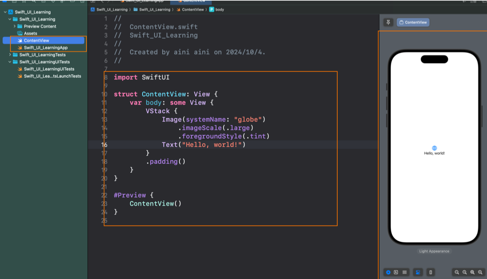

1. Swift_UI_Learning（项目名称）：

这是你的 SwiftUI 项目根目录，所有项目相关的文件和资源都位于此处。

2. Swift_UI_Learning 文件夹：

这个文件夹是项目的源代码文件夹，SwiftUI 项目的所有代码文件都放在这里。

3. Preview Content 文件夹：

这个文件夹通常用于存放 SwiftUI 预览内容。SwiftUI 提供实时预览功能，这里包含你在 SwiftUI 预览过程中使用 的图片或其他数据。

4. Assets 文件夹：

Assets 是用于存放项目中所需的图片、颜色、图标等资源的地方。这些资源可以通过 SwiftUI 的 UI 组件来调用。

Image

或其他

5. ContentView.swift：

是 SwiftUI 项目中的主视图文件。通常，当你创建一个新的 SwiftUI 项目时，Xcode 会自动生成 这个文件，它是应用的主用户界面。你会在这里编写 UI 代码，定义视图的布局、样式和交互。

ContentView

6. Swift_UI_LearningApp.swift：

这是 SwiftUI 应用的入口文件。在 SwiftUI 中，应用的生命周期和界面是由这个文件管理的。通常在这个文件中 你会看到 @main 属性，它标记了应用程序的主入口。这里你可以定义启动时加载的主视图（通常是

ContentView

）。

这个目录结构就是典型的 SwiftUI 项目，Xcode 自动为你生成这些基础文件，目的是帮助你快速开始搭建用户界面。

语法

```swift
import SwiftUI

struct Text_learning: View {

var body: some View { 
	Text("Hello, World!") 
	Text("my name is aini") 
	Text("hello aini ") 
	Text("shanghai") 
 }
}
#Preview { Text_learning() }
```

1. 字体大小 ()
SwiftUI 提供了很多系统预设的字体大小，常用于快速设置文本的字体样式。常用的字体包括：
.largeTitle
.title .title2
.title3
.headline
.subheadline
.body
.callout
.caption
.caption2
.footnote

2. 字体粗细 

SwiftUI 支持不同的字体权重（粗细），从极细到极粗。常用的权重包括： .ultraLight ：极细 
.thin ：很细
.light ：细
.regular ：正常：
.semibold ：半粗
.medium：中等 
.heavy ：很粗
.bold：粗 
.black：极粗``