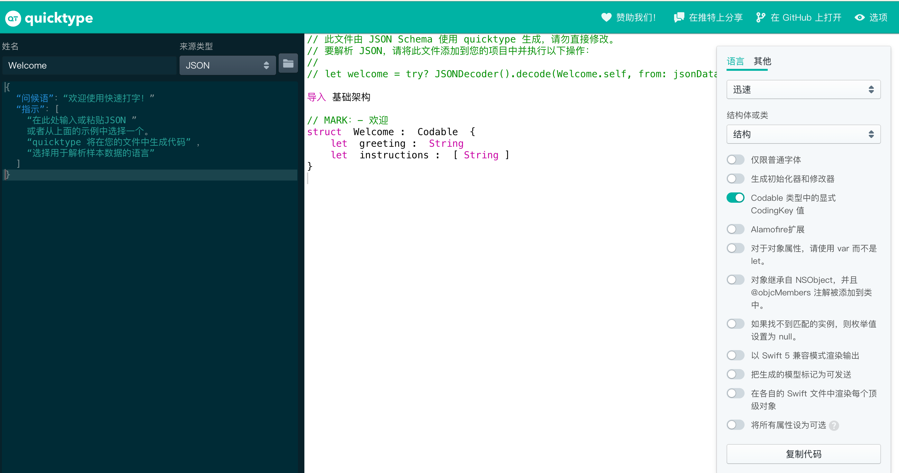

这正是 **JavaScript (动态类型)** 和 **Swift (静态强类型)** 最大的区别。

- **JavaScript:** 拿到数据就能直接点（`data.results[0].xxx`），非常灵活，但如果服务器改了字段名，你可能运行到那里才会报错。
    
- **Swift:** 必须先画好“模具”（Struct）。数据倒进来时，如果形状不对（类型不匹配或字段缺失），第一时间就会告诉你。这虽然写起来繁琐，但**非常安全**，而且代码补全（Autocomplete）会非常爽。
    

面对这种多层嵌套，我们通常采用 **“剥洋葱”** 或者 **“套娃”** 的思路：**由外向内，一层层定义 Struct**。

### 1. 你的 JSON 结构分析

我们把你提供的 JSON 格式化一下，看清楚层级：

JSON

```
{
  "code": 200,
  "msg": "xxx",
  "results": [          // 第一层数组
    {
      "data": [         // 第二层数组
        {
          "imageurl": "",
          "list": [     // 第三层数组
            { "a": "", "b": "", "c": "" }
          ]
        }
      ]
    }
  ]
}
```

### 2. Swift 写法：层层套娃

我们需要定义 **4 个 Struct** 来对应这 4 层结构。

Swift

```
import Foundation

// --- 第 4 层：最里面的 List 里的具体项 ---
struct DetailItem: Codable, Identifiable {
    // 技巧：如果没有唯一 id，可以用 UUID() 临时生成，方便 SwiftUI 的 List 使用
    let id = UUID()
    let a: String
    let b: String
    let c: String
    
    // CodingKeys: 告诉 Swift 忽略 id，因为它不在 JSON 里
    enum CodingKeys: String, CodingKey {
        case a, b, c
    }
}

// --- 第 3 层：Data 里的项 ---
struct DataItem: Codable, Identifiable {
    let id = UUID()
    let imageUrl: String // 注意：Swift 习惯用驼峰命名，下面我们会做映射
    let list: [DetailItem] // 嵌套了上一层的结构体数组
    
    enum CodingKeys: String, CodingKey {
        // 映射：JSON 里的 "imageurl" -> Swift 里的 "imageUrl"
        case imageUrl = "imageurl"
        case list
    }
}

// --- 第 2 层：Results 里的项 ---
struct ResultItem: Codable, Identifiable {
    let id = UUID()
    let data: [DataItem] // 嵌套了上一层的结构体数组
    
    enum CodingKeys: String, CodingKey {
        case data
    }
}

// --- 第 1 层：最外层的响应外壳 ---
struct APIResponse: Codable {
    let code: Int
    let msg: String
    let results: [ResultItem] // 嵌套了上一层的结构体数组
}
```

### 3. 如何使用它？

当你在 `ViewModel` 中请求回来数据后，直接解码最外层即可：

Swift

```
// 假设 data 是网络请求回来的二进制数据
do {
    let response = try JSONDecoder().decode(APIResponse.self, from: data)
    
    // 访问数据的方式 (类似 JS，但有类型提示)
    if let firstResult = response.results.first {
        print(firstResult.data[0].imageUrl)
    }
    
    // 判断业务状态码
    if response.code == 200 {
        // 成功处理...
    }
} catch {
    print("解析失败: \(error)")
}
```

### 4. 两个关键技巧（解决“JS 转 Swift”的不适应）

#### 技巧 A：使用 `CodingKeys` 解决命名风格冲突

后端（尤其是 PHP/Python）经常喜欢用下划线 `user_name` 或全小写 `imageurl`。 Swift 必须用驼峰 `userName`。 你不需要强迫后端改，也不用委屈自己写丑代码，用 `CodingKeys` 做个映射就好（如上面代码所示）。

#### 技巧 B：神器推荐 (必看！)

手动写上面那些 Struct 很累对吧？ 有一个网站叫 **QuickType (app.quicktype.io)**。
https://app.quicktype.io/
1. 把你的 JSON 复制粘贴进去。
    
2. 右边语言选择 **Swift**。
    
3. 它会自动帮你生成所有的 Struct 代码！
    
4. 直接复制到你的 Xcode 里即可。

